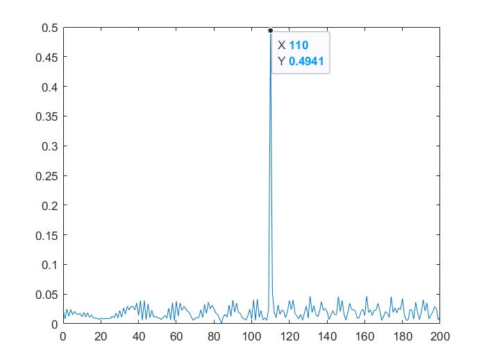
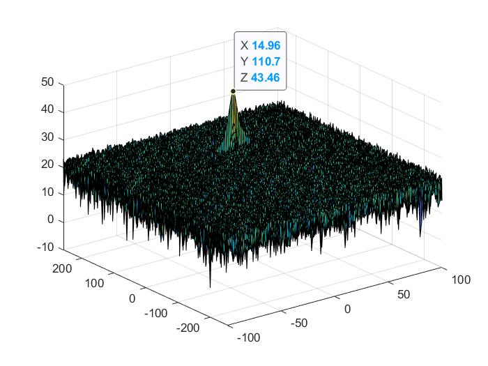
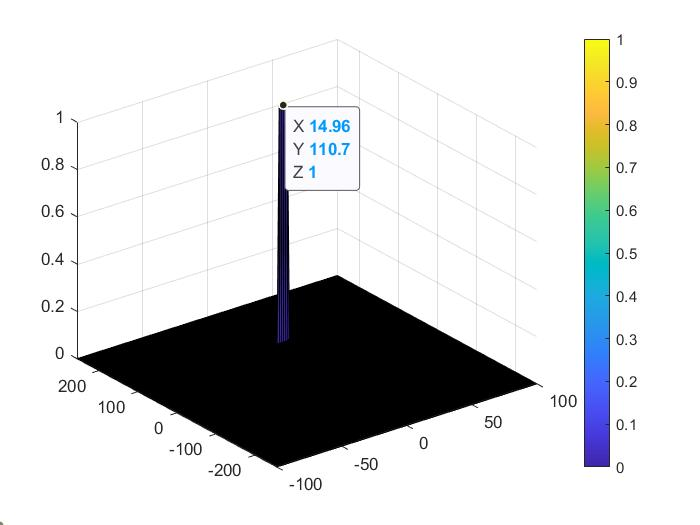

# Udacity_Radar_Project
This project shows the way radar is working and how we detect the position of objects.
- **Implementation steps for the 2D CFAR process**
   The 2D CFAR contains these steps shown as following:
  - Determine the numbers of  Training Cells and Guard Cells with `Tr Td Gr Gd`. For the sliding window in 2D DFAR,  the Cell Under Test *(CUT)* is in the middle, several guard cells with `2Gr*2Gd` dimensions stays around the CUT, eliminating the increase of  noise average due to the raising signal. The training cell with `2Tr*2Td` stays around the guarding cell to compute noise average. Here I select  `Tr=8, Td=4, Gr=4, Gd=3` to obtain a better recognition result.
  - For each cell with a whole slide window, we compute the noise average:
`noise_level(i,j)=(sum(sum(RDM_power(i-Tr-Gr:i+Tr+Gr,j-Td-Gd:j+Td+Gd)))-sum(sum(RDM_power(i-Gr:i+Gr,j-Gd:j+Gd))))/((2*Tr+2*Gr+1)*(2*Td+2*Gd+1) - (2*Gr+1)*(2*Gd+1));`

   - Then we can transform it into dB level and add the offset, comparing it to the Cell Under Test. The offset needs to be carefully selected, if the offset is too small, we will get a large range of possible area for the velocity and distance of the object; if too big, we won't get any result. Here, after several tests, I selected `offset=20`.
    - If the CUT is greater than the average noise, we set its value to 1, else to 0.
- **Selection of Training Cells, Guarding Cells and offset**
	 The final result of 2D CFAR is closely related to the selection of Training Cells, Guarding Cells and offset.
	1. Training cell: to detect average noise for CUT, in general, the more Training cells, the better average result. But if the scale of training cell is too large, the number of non-thresholded cells will increase and the compute time will increase as well. Also, the difference between `Td` and  `Tr` should not be too large. Here, after several test, I select `Td=8, Tr=5`.
	2. Guarding cell: to avoid the target signal from leaking into the training cells that could adversely affect the noise estimate. Since the target signal mainly occupies `10*10` cells in the experiment, we can select `Gr=4, Gd=3` to eliminate the effect of target signal.
	3. Offset: the noise average mainly stays around 0-20dB, and the signal peak is around 43dB, so we set `offset=18` to have a precise and reliable result.
- **Steps taken to suppress the non-thresholded cells at the edges**
	Here, we set all the non-thresholded cells to 0 to keep the map size as it was before 2D CFAR.
- **Results**
	In the test, we set the target is 110m away with velocity 15m/s. The result shows as follow:
	
	 We can see clearly that there is a peak at 110m.
	
	 The result is around 14.96m/s and 110.7m away.
	
	 The result shows clearly, the object is around 14.96m/s and 110.7m away.
- This project gives me the idea how the radar works and how to generate and process signal with FFT and 2D CFAR, which can be used in the future.
